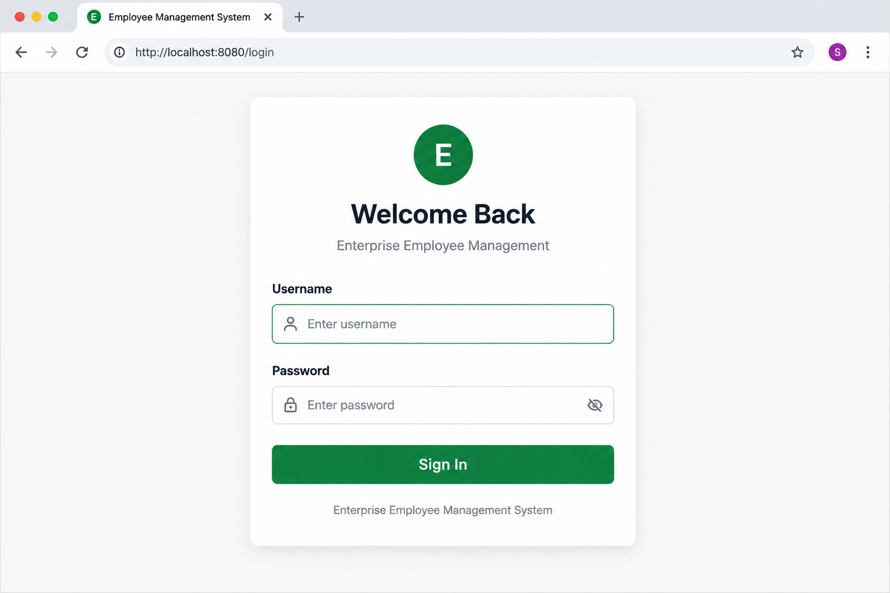
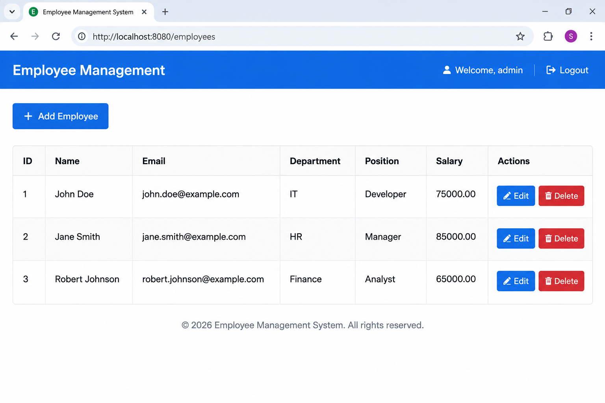

# Enterprise Employee Management System

A Java Spring Boot web application for managing employee records with secure authentication, CRUD operations, MySQL database integration, Spring Data JPA, Hibernate, and Thymeleaf.

## Features

- Admin login and logout using Spring Security
- Secure password handling with BCrypt
- Add employees
- View employees
- Edit employees
- Delete employees
- Automatic database ID generation
- MySQL database integration
- Spring Data JPA and Hibernate
- Thymeleaf-based web interface
- Protected employee management pages

## Technologies

- Java 17
- Spring Boot
- Spring MVC
- Spring Security
- Spring Data JPA
- Hibernate
- MySQL
- Thymeleaf
- HTML
- CSS
- Maven
- Git
- GitHub

## Project Structure

```text
src/
├── main/
│   ├── java/com/enterprise/employeemanagement/
│   │   ├── controller/
│   │   │   ├── EmployeeController.java
│   │   │   └── HomeController.java
│   │   ├── entity/
│   │   │   └── Employee.java
│   │   ├── repository/
│   │   │   └── EmployeeRepository.java
│   │   ├── service/
│   │   │   └── EmployeeService.java
│   │   ├── SecurityConfig.java
│   │   └── EnterpriseEmployeeManagementApplication.java
│   │
│   └── resources/
│       ├── templates/
│       │   ├── employee-form.html
│       │   ├── employees.html
│       │   ├── index.html
│       │   └── login.html
│       └── application.properties

## Application Screenshots

### Login Page



### Employee Management



│
├── test/
│
├── .gitignore
├── pom.xml
├── mvnw
└── mvnw.cmd
